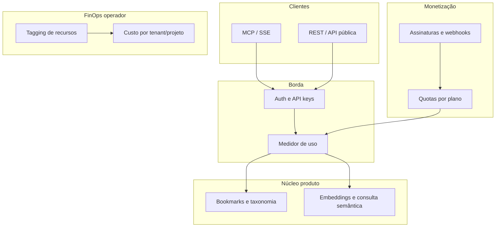

# Plano: SaaS com medidor de custos, assinaturas e RAG (mcp-bookmarks)

**Âmbito:** uso pessoal e experimentação. Não há produto comercial nem dados de terceiros a proteger com o rigor de um SaaS B2B; secções longe no tempo (billing, multi-tenant, FinOps pesado) são **opcionais** e só valem a pena se decidires evoluir para oferta paga. Até lá: destroy/rebuild, poucos backups e decisões simples são aceitáveis.

## Prioridade imediata (reordenação — março 2026)

1. **Consertar [blogmarks.dev](https://blogmarks.dev) em produção** — o que está partido hoje (deploy, API, auth, Lambda, DynamoDB, PWA) tem precedência sobre features novas no monorepo local.
2. **Salvar textos de forma fiável** — objetivo mínimo: conteúdo extraído (artigo/texto) persistido nos registos que o produto já usa (ex. campos `aiContent` / `content` na tabela de links), com monitorização de falhas e reprocessamento onde fizer sentido.
3. **MCPs no assistente para obter página / contexto** — integrar no fluxo do utilizador (Claude / Cursor) servidores MCP como **[Bright Data](https://brightdata.com/)** (scraping/proxy gerido) e/ou **[Tavily](https://tavily.com/)** (search API via MCP), para contornar bloqueios de fetch simples; o modelo usa essas tools e depois grava com **bookmarks MCP** (`save_bookmark`, `extract_content`, `set_summary`). Documentar custos, quotas e TOS.
4. **Replanejar** — após (1)–(3) estáveis, rever roadmap (PWA Share Target, CrewAI, Rust, billing, RAG/pgvector) com dados reais de uso e custo.

O resto do documento mantém o desenho de longo prazo; a **ordem de execução** passa a seguir a secção **Ordem de implementação sugerida** abaixo (atualizada).

## Fase 0 — Uso pessoal (prioridade agora)

Objetivo: **nenhuma conta AWS obrigatória**; dados só na máquina (ou volume Docker).

1. No repositório [mcp-bookmarks](README.md): `uv sync` (ou `pip install -e .`).
2. Subir o servidor: `uv run mcp-bookmarks` (default [SQLite](README.md) em `~/.mcp-bookmarks/bookmarks.db`, porta 8000).
3. Ligar o cliente MCP por **SSE** a `http://localhost:8000/sse` (ex.: `claude_desktop_config.json` com `"type": "sse"` e a URL, ou `claude mcp add --transport sse bookmarks http://localhost:8000/sse`).
4. Usar as tools (`save_bookmark`, `save_and_tag`, `knowledge_query`, etc.) no assistente; o RAG nesta fase é **sobre o texto já guardado** nos bookmarks (não exige pgvector na nuvem).
5. Alternativa: `podman compose up -d` com [compose.yaml](compose.yaml) (SQLite em volume `/data`).

**Não fazer nesta fase:** Terraform, DynamoDB, ECS, billing — isso fica para quando quiseres SaaS ou sincronizar com o PWA blogmarks (`DYNAMODB_MODE=true`).

## Fase 0b — Crew de agentes (CrewAI open source) para extrair e tagear

Objetivo: **disparar um crew** ([CrewAI](https://github.com/crewAIInc/crewAI) OSS) que orquestre agentes especializados (ex.: obter HTML/metadata, extrair artigo, propor tags face à taxonomia existente, gravar resumo) em vez de depender só do assistente MCP interativo ou do [lambda/handler.py](lambda/handler.py) na AWS.

**Relação com o que já existe**

- [scraper.py](src/mcp_bookmarks/scraper.py) (trafilatura + OG) pode ser **reutilizado** como tool Python dentro de um agente “Extractor”, ou o crew chama apenas a **REST** `POST /api/save` / fluxo MCP via cliente HTTP, para não duplicar lógica.
- As tools MCP `get_tags`, `create_tag`, `tag_bookmark`, `set_summary` definem o **contrato** semântico; o crew deve respeitar a mesma política: **reutilizar tags** da taxonomia quando possível ([README](README.md) — deduplicação por descrição).

**Desenho sugerido (implementação futura)**

1. **Pacote ou pasta** no repo (ex. `crew_runner/`) com `crewai` como dependência opcional (`optional-dependencies` no [pyproject.toml](pyproject.toml)) para não pesar quem só quer o MCP.
2. **Agentes típicos:** (a) *Fetcher* — URL → conteúdo bruto ou chamada ao scraper; (b) *Librarian* — lê `get_tags` / taxonomia e decide slugs; (c) *Editor* — resume e devolve texto para `set_summary`; (d) opcional *Critic* — revisa consistência das tags.
3. **Tools CrewAI:** wrappers que chamam **SQLite** via funções internas **ou** `httpx` contra `http://localhost:8000` (MCP é SSE; para automação costuma ser mais simples **REST** onde existir, ou biblioteca cliente que invoque tools — avaliar na implementação).
4. **Disparo:** CLI `uv run blogmarks-crew --urls-file …` ou fila de IDs pendentes na base; no SaaS futuro, o mesmo crew pode correr em **worker** (ECS/Lambda com timeout alto) com rate limit.

**Custos e segredos:** o crew consome **API de LLM** (OpenAI, Anthropic, etc., conforme configurares no CrewAI); uso pessoal = chaves no `.env`, fora do repositório.

**Riscos:** latência e custo em lotes grandes; definir `max_iter` / batch pequeno; idempotência ao reprocessar o mesmo `bookmark_id`.

**Integração com Rust (Fase 0c):** o agente *Fetcher* / tool de extração pode invocar um **CLI Rust** (stdin URL → stdout JSON com título, texto, metadados) em vez de trafilatura Python, para lotes grandes — o crew permanece em Python.

## Fase 0c — Rust onde compensa (velocidade + narrativa de carbono)

**Objetivo:** implementar em **Rust** as partes **CPU-bound e de alto volume** em que o ganho é claro: menos tempo de CPU e, na mesma infra, menos energia por unidade de trabalho do que um interpretador a fazer o mesmo em loop. Posicionamento público: **binários nativos eficientes**; evitar afirmações vagas — alinhar com **menos CPU-seconds** / **menos memória** por bookmark processado e, em cloud, com **instâncias certas** (ver FinOps no plano).

**Manter em Python (por agora):** servidor **MCP** (FastMCP), **CrewAI**, grande parte das integrações AWS via boto3, e fluxos onde o ecossistema Python já está maduro. Reavaliar **servidor MCP em Rust** (ex. crates do ecossistema MCP) só como evolução se o custo de manutenção valer a pena.

**Candidatos Rust prioritários**

1. **Pipeline fetch + metadados + texto principal** — `reqwest` + parser HTML + extração tipo readability (ex. `readability`, `scraper`, ou crate equivalente); saída **JSON estável** consumida por [scraper.py](src/mcp_bookmarks/scraper.py) (fallback) ou substituição gradual.
2. **Worker de lote** — consumir fila de URLs ou IDs, processar em paralelo com `tokio`, emitir resultados (útil para crew e para Lambda/container com binário estático `musl`).
3. **Cliente de embeddings em massa** — HTTP concorrente com limites de taxa (quando existir pipeline de vetores); reduz wall-clock e tempo de vCPU frente a script síncrono.
4. **CLI único** `blogmarks-ingest` — empacotado com `cargo build --release`; assinatura verificável nos releases.

**Integração com o monorepo**

- Diretório sugerido: `rust/` ou `crates/blogmarks-fetch` no mesmo repositório; **artifact** copiado para imagem Docker / layer Lambda (custom runtime ou wrapper).
- Contrato: **JSON lines** ou um JSON por invocação; timeouts e tamanho máximo de HTML definidos no Rust para segurança.

**Comunicação (“carbono”)**

- Mensagens aceitáveis: “**Menos overhead de runtime**: binário nativo reduz CPU e memória por ingestão em benchmarks internos vs. caminho X.”
- Evitar: “Carbon neutral” sem dados; preferir **métricas** (tempo de CPU, tamanho de imagem, região) e **boas práticas** (escalar a zero quando possível, tags de custo já previstas no Terraform).

**Riscos:** duas linguagens (CI, onboarding); paridade de qualidade texto vs. trafilatura — definir **testes de regressão** com URLs fixas antes de trocar default.

## Fase 0d — MCP O'Reilly (pesquisa em livros e outras mídias)

**Objetivo:** usar o **servidor MCP da O'Reilly** junto do **mcp-bookmarks** para o modelo pesquisar conteúdo da [plataforma O'Reilly](https://www.oreilly.com/) (livros, vídeos, cursos, etc., conforme o catálogo e as tools expostas pelo MCP) e, quando fizer sentido, **persistir** descobertas na tua base pessoal (bookmark + tags + resumo).

**Contexto:** a O'Reilly anunciou integração MCP para incorporar pesquisa/aprendizagem em fluxos com IA (ex.: Cursor, Claude Code, VS Code); requer **acesso à plataforma** conforme o teu plano empresarial ou individual e as regras de uso — validar sempre na documentação oficial atual.

**Abordagem recomendada (baixo acoplamento, imediata)**

1. **Dois MCP servers no mesmo cliente** (Cursor / Claude Desktop / Claude Code): um aponta para o **O'Reilly MCP** (configuração e credenciais que a O'Reilly indicar), outro para `http://localhost:8000/sse` (blogmarks).
2. **Fluxo cognitivo:** o assistente chama as tools do O'Reilly para **descobrir e citar** trechos/recursos; depois chama `save_bookmark` / `save_and_tag` com URL ou referência que possas guardar (ex. link público ou nota com ISBN/título, conforme o que a política de conteúdo permitir exportar).
3. **Documentação no repo:** secção no [README.md](README.md) com variáveis de ambiente, exemplo de `mcpServers` (sem expor segredos), e **prompts exemplo**: “Pesquisa na O'Reilly sobre X; resume; sugere tags da minha taxonomia; grava o melhor recurso como bookmark.”

**Evoluções opcionais (só após validar licenciamento)**

- **Prompt MCP** reutilizável no projeto que encoraje sempre o uso combinado das duas origens (O'Reilly + `bookmarks://taxonomy`).
- **Servidor agregador** (nosso processo) que fale com os dois backends: só se for tecnicamente e **legalmente** aceitável; caso contrário manter **multi-MCP no cliente**.

**Riscos:** termos de serviço e **direitos de conteúdo** (não reproduzir ilegalmente obras completas nas notas); armazenar **tokens** só em segredo local ou Secrets Manager em produção; disponibilidade do MCP oficial pode ser **enterprise-only** — ter fallback documentado (pesquisa manual na plataforma + bookmark da URL).

## Fase 0e — PWA mobile Android (Share Target API)

**Objetivo:** no telemóvel Android, **partilhar** uma página (Chrome, Twitter, etc.) para a **PWA Blogmarks**; a app recebe URL/título via [Web Share Target](https://developer.mozilla.org/en-US/docs/Web/Progressive_web_apps/How_to/Share_data_between_apps) e **ingere** o website na mesma pipeline de backend que o resto do produto (fila → extração → tags).

**Requisitos técnicos**

- **HTTPS** e domínio estável (Share Target em PWA exige contexto seguro).
- **Web App Manifest** (`share_target`) com `action` apontando para rota dedicada (ex. `/share`) que lê `POST` (form `url`, `text`, `title`) ou query conforme spec.
- **Service Worker** opcional para fila offline (“guardar local e sincronizar quando online”).
- **Autenticação:** cookie de sessão ou token após login na PWA; o endpoint de ingestão **não** pode ser público sem utilizador.
- **Ligação ao backend:** mesma API que já persiste bookmarks (ex. REST `POST /api/save` estendido com auth, ou endpoint específico `POST /api/ingest/share` que devolve `job_id`).

**UX:** ecrã de confirmação (“Guardar em Blogmarks?”) + escolha de tags rápidas; feedback de processamento assíncrono (toast / lista “A processar”).

**Nota de repo:** o PWA pode viver no mesmo monorepo ou repositório **blogmarks** existente; alinhar com [dynamodb.py](src/mcp_bookmarks/dynamodb.py) / API cloud.

## Fase 0f — Tópicos frequentes e rascunho de artigo (agentes)

**Objetivo (MVP):** além de guardar bookmarks, usar **IA** para (1) **extrair** tópicos/entidades por item; (2) **agregar** no tempo (contagem, janela móvel); (3) quando um tópicos cluster ganha massa, **gerar rascunho** de artigo que sintetiza fontes guardadas (com citações/links).

**Fluxo sugerido**

1. **Extração por bookmark** — job assíncrono (Lambda/worker) ou agente CrewAI: input = texto extraído + URL; output = lista normalizada de tópicos (slug/canónico) gravada em DynamoDB ou tabela `topic_mentions` (bookmark_id, topic_slug, score, ts).
2. **Agregação** — consulta materializada ou job diário: `topic_slug → count_7d, count_30d, exemplos[]`.
3. **Artigo** — agente “Editor” com prompt restrito: usar só trechos e links dos bookmarks do utilizador; output Markdown em registo `draft_articles` (estado `pending_review`); **revisão humana obrigatória** antes de publicar.

**Riscos:** alucinação e plágio — exigir **atribuição** por frase; limitar comprimento; opt-in do utilizador para gerar rascunho.

## Infraestrutura descartável (destroy / rebuild “como novo”)

**Estado atual (confirmado):** o software **ainda não esteve em produção** com dados reais — **não há backup legado a preservar**. Podes iterar com `**terraform destroy` + `apply`** à vontade para validar IaC; trata como **greenfield puro** até ao lançamento.

**Requisito:** o ambiente na **nuvem** deve poder ser **destruído e recriado** de forma controlada, sem dependência de “servidores manuais” ou configuração só na consola.

**Práticas**

- **Tudo em IaC** ([terraform/](terraform/) ou equivalente): `terraform destroy -target=…` ou destroy completo de stack de **app + rede efémera**, com procedimento documentado.
- **Estado Terraform** remoto (S3 + DynamoDB lock) para o próprio estado sobreviver ao destroy dos recursos geridos.
- **Dados:** **agora** — aceitar perda de dados de experimentação (nada crítico). **Antes do primeiro utilizador / go-live:** passar a (A) snapshots RDS ou (B) export DynamoDB para S3 antes de destroy, ou (C) stack “data” com ciclo de vida mais conservador que “compute”; nunca destroy cego em produção com utilizadores sem política de backup.
- **Secrets:** recriados no novo ambiente (Secrets Manager / SSM); rotação de chaves após rebuild.
- **CI/CD:** pipeline que faz `plan` em PR e `apply` pós-merge; opcional ambiente efémero por branch.

*(Nota: a tua mensagem cortou em “Dessa ve…”; o plano assume **rebuild greenfield da camada de infra gerida**, com política de dados documentada.)*

## Contexto atual

O projeto já tem: servidor MCP + REST (`[src/mcp_bookmarks/server.py](src/mcp_bookmarks/server.py)`, `[src/mcp_bookmarks/api.py](src/mcp_bookmarks/api.py)`), backends SQLite e DynamoDB (`[src/mcp_bookmarks/dynamodb.py](src/mcp_bookmarks/dynamodb.py)`), pipeline de conteúdo/OG (`[src/mcp_bookmarks/scraper.py](src/mcp_bookmarks/scraper.py)`), prompt `knowledge_query` (RAG sobre bookmarks) e infra AWS de referência (`[lambda/template.yaml](lambda/template.yaml)`: DynamoDB + Lambda + Streams).

Limitações para SaaS: `DYNAMODB_USER_ID` fixo, sem isolamento forte por organização, sem camada de cobrança nem telemetria de uso agregada para faturamento.

## Visão em camadas

## 1. Multi-tenancy e identidade

- **Modelo de tenant**: `organization_id` (e opcionalmente `user_id`) em todos os itens DynamoDB e em logs de uso; substituir o uso único de `[DYNAMODB_USER_ID](README.md)` por resolução a partir do token/API key.
- **Auth**: JWT (ex.: Cognito Hosted UI ou Clerk/Auth0) para dashboard e fluxos humanos; **API keys** com escopos para MCP/integrações.
- **Isolamento**: GSI ou padrão de chave composta `(tenant_id, resource_id)` nas tabelas; políticas IAM mínimas por serviço; nunca misturar dados entre tenants nas queries.

## 2. Gerenciador de assinaturas

- **Provedor**: Stripe Billing (ou equivalente com suporte a webhooks e portal do cliente) como padrão pragmático para SaaS B2B/B2C.
- **Fluxos**: criação de customer ao signup; `checkout` / `customer.portal`; webhooks (`customer.subscription.`*, `invoice.paid`) para atualizar estado `active|past_due|canceled` no seu banco (DynamoDB ou tabela dedicada `subscriptions`).
- **Planos**: mapear SKUs a limites (armazenamento, requisições RAG/mês, número de bookmarks indexados, seats) na camada de aplicação, não só no provedor.

## 3. Medidor de custos (dois eixos)

**A) Uso para o negócio (cobrança e quotas)**

- Eventos append-only: ex. `usage_events` (tenant_id, tipo: `mcp_tool`, `rag_query`, `bookmark_ingest`, bytes armazenados, tokens LLM se aplicável, timestamp).
- Agregação diária/mensal para faturamento por consumo e alertas de quota (antes de bloquear ou cobrar overage).
- Pontos de instrumentação: wrapper nos tools MCP em `[server.py](src/mcp_bookmarks/server.py)`, rotas REST em `[api.py](src/mcp_bookmarks/api.py)`, e futuro endpoint de query vetorial.

**B) FinOps (custo real na nuvem)**

- **AWS (primeiro)**: etiquetar recursos com `tenant_id` / `env` / `service=mcp-bookmarks`; Cost Explorer API ou CUR em S3 + job agregador; Budgets e alarmes.
- **Azure / GCP (fase posterior)**: mesmo princípio (tags + export de custo + agregação); IaC reprodutível reduz drift entre nuvens.

## 4. Produto “dados semânticos as a service” (RAG)

- **Ingestão**: reutilizar conteúdo já extraído (trafilatura) para gerar chunks + embeddings; fila (SQS) ou pipeline assíncrono alinhado ao padrão já usado com Streams + Lambda.
- **Armazenamento vetorial**: escolha inicial recomendada na AWS (ex. OpenSearch Serverless com políticas por tenant, ou Aurora/pgvector se preferir SQL) — decisão técnica explícita na implementação por custo e isolamento.
- **API**: expor `knowledge_query` (e variantes) com autenticação, rate limit e registro no medidor de uso; opcionalmente API REST separada do SSE MCP para clientes não-MCP.

## 5. Operação em produção (nuvem pública)

- **Fase 1 – AWS**: containerizar o servidor MCP+API (já há `[Containerfile](Containerfile)`); orquestrar com ECS Fargate ou App Runner + ALB; API Gateway ou ALB com mTLS/API keys; secrets em Secrets Manager; DynamoDB + (vetor) + Lambda conforme template existente, estendido para multi-tenant.
- **Fase 2 – portabilidade**: manter app em containers e IaC declarativo (CDK/Terraform) com módulos por provedor; evitar acoplamento a um único SDK onde der para usar abstrações (ex. S3-compatível, Postgres).
- **Destroy/rebuild**: alinhar com a secção **Infraestrutura descartável** — nenhum recurso crítico só na consola; runbook de recriação e backup de dados em produção.

## 6. Segurança e conformidade (mínimo viável comercial)

- **Para projeto pessoal:** HTTPS, secrets fora do git e backups quando tiveres dados que não queiras perder chegam longe; o resto abaixo aplica-se sobretudo se fores a SaaS com utilizadores externos.
- Criptografia em repouso (KMS) e em trânsito; auditoria de acesso admin; política de retenção e export/delete por tenant (LGPD/GDPR como requisito de produto).
- Separação de ambientes (staging/prod) e secrets por ambiente.

## Ordem de implementação sugerida

1. **blogmarks.dev produção:** corrigir stack live; smoke tests; persistência de texto verificada ponta a ponta.
2. **MCP Bright Data + Tavily (ou um deles):** configurar no cliente, prompts padrão, e fluxo “fetch/search → gravar no blogmarks”.
3. **Checkpoint — replanejar:** revisar backlog (O’Reilly, CrewAI, PWA, Rust, SaaS) com base no que aprendeste em produção.
4. **Uso pessoal / mcp-bookmarks local:** SQLite ou Compose; MCP em `localhost` para desenvolvimento paralelo.
5. **O'Reilly MCP (0d):** segundo servidor MCP no cliente + README/prompts.
6. **CrewAI / blogmarks-crew:** lote e agentes; alinhar com API de produção quando estável.
7. **Rust (0c):** hot path de fetch se ainda fizer sentido após Bright Data/Tavily.
8. **PWA Android + Share Target (0e)** quando o backend prod estiver sólido.
9. **Tópicos → artigo (0f)** MVP.
10. **Infra descartável** [terraform/](terraform/) e política de dados pós–primeiro utilizador.
11. Multi-tenant, billing, usage_meter, RAG/pgvector, hardening — conforme decisão pós-checkpoint.

## Riscos e decisões a fixar na implementação

- **CrewAI vs MCP nativo**: crew é melhor para **batch e papéis explícitos**; MCP continua a interface humana. Evitar duas fontes de verdade para tagging — preferir chamadas à mesma camada `db` ou REST.
- **Rust + Python**: custo de manutenção e CI duplo; documentar como compilar e onde o binário entra na imagem; paridade de extração de texto vs. trafilatura com testes de URL fixos.
- **O'Reilly MCP**: dependência de **assinatura/acesso** e TOS; não agregar cópia de obras protegidas nos bookmarks sem direito; tokens fora do git.
- **Isolamento vetorial**: índice por tenant vs. índice compartilhado com filtro obrigatório — impacta custo e segurança.
- **Preço do embedding/LLM**: decidir se entra no “pacote” ou é pass-through + margem; isso define granularidade dos eventos de uso.
- **Dependência blogmarks.dev**: alinhar se o SaaS é fork independente ou continua compartilhando tabelas com o PWA existente.
- **Bright Data / Tavily:** custo por requisição, scraping ethics e TOS dos sites alvo; não substituir revisão humana para conteúdo sensível.
- **Share Target / PWA:** fragmentação Android vs Chrome; testes em dispositivo real; deep links.
- **Destroy infra:** com **dados reais em produção**, RDS/DynamoDB no destroy sem snapshot = perda; até lá, risco operacional baixo. Escalar política quando houver utilizadores.
- **Artigos gerados:** qualidade factual e direitos sobre texto agregado; disclaimers e opt-in.

