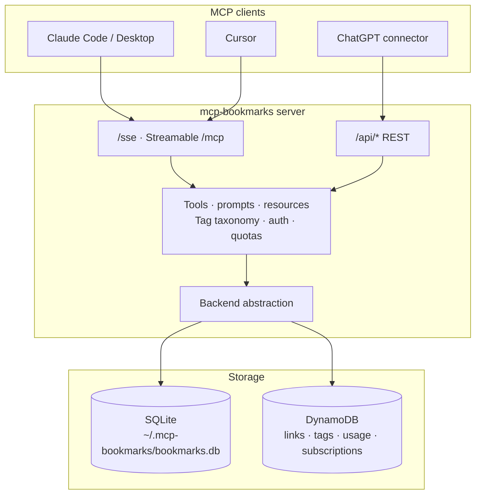
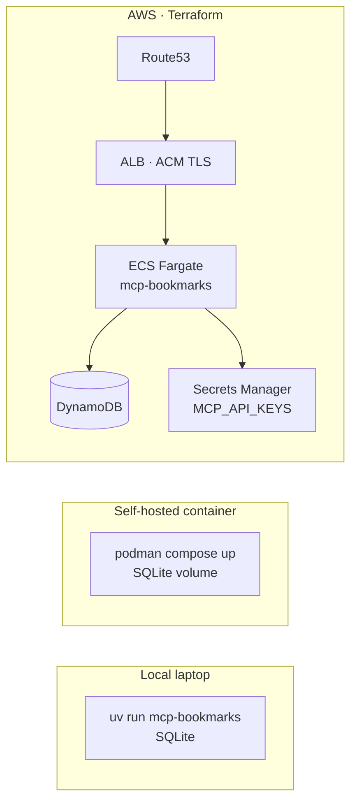

# mcp-bookmarks

**Bookmark intelligence platform with MCP + REST + dual-backend cloud architecture.**

Save URLs, extract Open Graph + full article text, and build a curated tag taxonomy where the LLM decides tag reuse. The same server speaks **MCP** (Claude Desktop, Claude Code, Cursor, ChatGPT custom connectors) and **REST** (`/api/*`), backed by **SQLite** for local-only use or **DynamoDB** for multi-tenant cloud deployments.

| | |
|---|---|
| **Who it's for** | Developers, agents, teams that want one curated link store wired into MCP clients |
| **Where it runs** | Laptop (SQLite, single binary) → Self-hosted container → AWS ECS Fargate (Terraform) |
| **What's in the box** | MCP server · REST API · SQLite + DynamoDB backends · Tag taxonomy · Auth/quotas/Stripe webhook · Terraform infra |
| **Status** | v0.11.2 · Core surface stable · See [Production-ready vs experimental](#production-ready-vs-experimental) |

## Architecture



Same 19 tools, 4 prompts, 2 resources across both transports. Switch backends with `DYNAMODB_MODE=true`. Same `BookmarkBackend` contract; capability differences (e.g. embeddings) are explicit, not hidden.

## Quick start

```bash
# Install
uv sync

# Run (SQLite, ~/.mcp-bookmarks/bookmarks.db)
uv run mcp-bookmarks
# → http://0.0.0.0:8000/sse   (SSE — Claude Code, Cursor)
# → http://0.0.0.0:8000/mcp   (Streamable HTTP — ChatGPT)
# → http://0.0.0.0:8000/api/  (REST)
```

### Connect a client

```bash
# Claude Code
claude mcp add --transport sse bookmarks http://localhost:8000/sse

# Cursor — .cursor/mcp.json
{ "mcpServers": { "bookmarks": { "type": "sse", "url": "http://localhost:8000/sse" } } }

# ChatGPT — Settings → Connectors → Custom → http://localhost:8000/mcp
```

Full per-client guides: [docs/demo/](docs/demo/).

## Deployment



| Mode | Command | Use when |
|---|---|---|
| **Local SQLite** | `uv run mcp-bookmarks` | Single user, local dev, fastest path |
| **Container** | `podman compose up -d` | Self-hosted, single instance |
| **AWS Fargate** | `cd terraform && terraform apply -var='mcp_hostname=...' -var='enable_alb=true' -var='ecs_desired_count=1'` | Multi-user, hosted, with auth + quotas |

The Terraform stack provisions VPC, ECS Fargate, ALB+ACM, DynamoDB (links/tags/usage/subscriptions), RDS (pgvector-ready, optional), Secrets Manager, IAM, and budget alarms. See [`terraform/README.md`](terraform/README.md).

## Demo flow (5 minutes)

```
1. save_bookmark("https://martinfowler.com/articles/2025-llm-agent.html")
   → bookmark_id (UUID in DynamoDB, int in SQLite)
2. Read resource bookmarks://taxonomy
   → tag list with descriptions + usage counts
3. Prompt save_and_tag(url)
   → extract → tag → summarize, one shot
4. search_bookmarks(query="agents")
   → new item appears
5. read_bookmark(<id>)
   → confirm aiContent, aiSummary, aiTags written
```

Per-client variants: [Claude Code](docs/demo/claude-code.md) · [Cursor](docs/demo/cursor.md) · [ChatGPT](docs/demo/chatgpt.md).

## Production-ready vs experimental

| Feature | Status | Notes |
|---|---|---|
| MCP server (SSE + Streamable HTTP) | ✅ Production | 19 tools, 4 prompts, 2 resources; transport-agnostic |
| REST API (`/api/*`) | ✅ Production | Auth via `MCP_API_KEYS`; per-tenant routing via `key:org` |
| SQLite backend | ✅ Production | Full tools incl. embeddings + semantic search |
| DynamoDB backend | ✅ Production | Keyword search only; vector pipeline is design-stage |
| Tag taxonomy + LLM dedup | ✅ Production | The product wedge — see [Tag deduplication strategy](#tag-deduplication-strategy) |
| Auth + quotas + Stripe webhook | ✅ Production | Hooks + storage; not a full SaaS entitlement engine |
| Terraform AWS deploy | ✅ Production | ECS Fargate + ALB + DynamoDB; see [`terraform/`](terraform/) |
| **AI Gateway ensemble + judge** | 🧪 Experimental | `ENSEMBLE_ENABLED=true`; N+1 cost; see [`docs/ai-gateway-ensemble.md`](docs/ai-gateway-ensemble.md) |
| **`/ai-gateway` browser panel** | 🧪 Experimental | Browser harness for the ensemble tool |
| **O'Reilly + Bright Data multi-MCP** | 🧪 Experimental | Compose three MCPs in the client; see [`docs/integracao-mcp-oreilly-brightdata.md`](docs/integracao-mcp-oreilly-brightdata.md) |
| **Rust topic-compiler** | 🧪 Experimental | sage-wiki-style topic articles from corpus; see [`docs/knowledge-extraction-pipeline.md`](docs/knowledge-extraction-pipeline.md) |
| **DynamoDB vector pipeline** | 📋 Design only | Chunking + embedding + ANN; see [`docs/dynamodb-rag-design.md`](docs/dynamodb-rag-design.md) |
| **Sample enrichment Lambda** | 🧪 Experimental | Processor template in `lambda/`; align schema before pointing at prod |
| **Multicloud** | 📋 Notes only | See [`docs/multicloud.md`](docs/multicloud.md) |
| **Slidev presentation** | 🧪 Asset | Pitch deck under [`presentation/`](presentation/) |
| **React dashboard snippet** | 🧪 Asset | UI snippet under [`dashboard/`](dashboard/) |

## Tools, prompts, resources

<details>
<summary><b>Tools</b> — 19 functions exposed via MCP</summary>

| Tool | Description |
|---|---|
| `save_bookmark(url)` | Fetch URL, extract OG metadata, store bookmark |
| `extract_content(bookmark_id)` | Extract full article text via trafilatura |
| `set_bookmark_body(bookmark_id, text)` | Store text from another fetch tool (Bright Data, Tavily, etc.) |
| `read_bookmark(bookmark_id)` | Get full bookmark details including content |
| `get_tags(query?)` | List canonical tags with descriptions and usage counts |
| `create_tag(slug, name, description)` | Create a new tag — only when no existing tag fits |
| `tag_bookmark(bookmark_id, tag_slugs)` | Assign existing tags to a bookmark |
| `untag_bookmark(bookmark_id, tag_slugs)` | Remove tags from a bookmark |
| `search_bookmarks(query?, tag?, limit?)` | Search by text or filter by tag |
| `set_summary(bookmark_id, summary)` | Store an AI-generated summary |
| `get_stats()` | Total bookmarks and tags count |
| `delete_bookmark(bookmark_id)` | Delete a bookmark |
| `update_tag(slug, name?, description?)` | Update tag metadata |
| `delete_tag(slug)` | Delete a tag from all bookmarks |
| `merge_tags(source, target)` | Merge duplicate tags |
| `export_bookmarks(format?, tag?)` | Export as JSON, Markdown, or OPML |
| `index_bookmark_embedding(bookmark_id)` | SQLite only · OpenAI embedding for title+description+content |
| `semantic_search_bookmarks(query, limit?)` | SQLite only · cosine similarity over stored embeddings |
| `ensemble_with_judge(task, models?, judge_model?)` | 🧪 Experimental · N models via OpenAI-compatible gateway, LLM judge picks best |

</details>

<details>
<summary><b>Prompts</b> — 4 multi-step pipelines</summary>

| Prompt | Args | Description |
|---|---|---|
| `save_and_tag` | `url` | Full pipeline: save → extract → tag → summarize |
| `bulk_save` | `urls` (newline-separated) | Batch process multiple URLs |
| `curate_tags` | — | Audit taxonomy for duplicates, gaps, weak descriptions |
| `knowledge_query` | `question` | RAG: search bookmarks and synthesize an answer |

</details>

<details>
<summary><b>Resources</b> — 2 read-only context channels</summary>

| URI | Description |
|---|---|
| `bookmarks://taxonomy` | Full tag list with descriptions — ideal pre-context for tagging |
| `bookmarks://recent/{count}` | Last N bookmarks with tags and summaries |

</details>

## Tag deduplication strategy

Instead of rules, the LLM reads the full taxonomy and **semantically decides** tag reuse. Each tag carries a scoped description:

```json
{
  "slug": "machine-learning",
  "name": "Machine Learning",
  "description": "General ML concepts, algorithms, training techniques. NOT specific frameworks.",
  "usage_count": 47
}
```

This prevents `ml`, `ML-algorithms`, `machine_learning` from proliferating across saves.

## Configuration

<details>
<summary><b>Environment variables</b></summary>

| Variable | Default | Description |
|---|---|---|
| `MCP_PORT` | `8000` | Server port |
| `MCP_HOST` | `0.0.0.0` | Server bind address |
| `BOOKMARKS_DB_PATH` | `~/.mcp-bookmarks/bookmarks.db` | SQLite path (SQLite mode only) |
| `DYNAMODB_MODE` | `false` | Set `true` to use DynamoDB instead of SQLite |
| `DYNAMODB_LINKS_TABLE` | `mcp-bookmarks-links` | DynamoDB bookmark items table |
| `DYNAMODB_TAGS_TABLE` | `mcp-bookmarks-tags` | DynamoDB tag taxonomy table |
| `DYNAMODB_USER_ID` | `mcp-agent` | userId stamped on MCP-saved bookmarks |
| `DYNAMODB_ORG_ID` | — | Optional org/tenant id for DynamoDB isolation + MCP usage tenant |
| `DYNAMODB_USAGE_TABLE` | — | DynamoDB table for usage events when in cloud |
| `DYNAMODB_SUBSCRIPTIONS_TABLE` | — | Stripe subscription rows (webhook) |
| `MCP_API_KEYS` | — | Comma-separated REST API keys (`key` or `key:org`) |
| `MCP_MONTHLY_USAGE_LIMIT` | `0` | Monthly quota (0 = off); enforced on MCP tools + REST save |
| `MCP_BEARER_AUTH` | `false` | Enforce bearer auth on `/mcp`, `/sse`, `/messages` |
| `COGNITO_USER_POOL_ID` / `COGNITO_CLIENT_ID` / `COGNITO_REGION` | — | Validate JWTs from a first-party Cognito user pool |
| `MCP_CONNECTIONS_TABLE` | `mcp-bookmarks-connections` | DynamoDB table for `bm_v1_*` scoped tokens |
| `STRIPE_WEBHOOK_SECRET` | — | `whsec_...` for `/webhooks/stripe` |
| `OPENAI_API_KEY` | — | Embeddings for semantic search tools |
| `OPENAI_EMBED_MODEL` | `text-embedding-3-small` | Embedding model id |
| `ENSEMBLE_ENABLED` | `false` | 🧪 Allow `ensemble_with_judge` + `POST /api/ensemble` |
| `AI_GATEWAY_BASE_URL` | — | 🧪 Gateway OpenAI-compatible (e.g. `https://api.openai.com/v1`) |
| `AI_GATEWAY_API_KEY` | — | 🧪 Overrides `OPENAI_API_KEY` for ensemble calls if set |
| `ENSEMBLE_MODELS` | — | 🧪 Default comma-separated models when the tool omits `models` |
| `JUDGE_MODEL` | `gpt-4o-mini` | 🧪 Model that scores/merges candidate answers |
| `AWS_DEFAULT_REGION` | `us-east-1` | AWS region for DynamoDB |

</details>

## Extensions & experiments

These are real but call them out explicitly so they don't dilute the core pitch.

**AI Gateway ensemble + LLM judge** — Run N models via an OpenAI-compatible gateway and a judge model picks/merges. Tool: `ensemble_with_judge`, REST: `POST /api/ensemble`, browser harness at `/ai-gateway`. Enable with `ENSEMBLE_ENABLED=true`. Cost: N+1 model calls per invocation. See [`docs/ai-gateway-ensemble.md`](docs/ai-gateway-ensemble.md).

**O'Reilly + Bright Data multi-MCP composition** — Three MCPs in the client: bookmarks for storage, Bright Data for hard-to-fetch URLs, O'Reilly for first-party content. Walk-through (PT): [`docs/integracao-mcp-oreilly-brightdata.md`](docs/integracao-mcp-oreilly-brightdata.md). Compliance notes (EN): [`docs/oreilly-mcp.md`](docs/oreilly-mcp.md). Generic fetch MCPs: [`docs/mcp-fetch-integrations.md`](docs/mcp-fetch-integrations.md).

**Rust topic-compiler** — Standalone binary in [`rust/topic-compiler/`](rust/topic-compiler/) that turns the bookmark corpus into a sage-wiki-style Markdown collection (one article per topic, interlinked, with typed ontology edges). Source: SQLite or DynamoDB. See [`docs/knowledge-extraction-pipeline.md`](docs/knowledge-extraction-pipeline.md) and [`docs/topic-article-pipeline.md`](docs/topic-article-pipeline.md).

**DynamoDB vector pipeline (design only)** — Chunking, embedding model versioning, vector store (pgvector / OpenSearch k-NN) — written up in [`docs/dynamodb-rag-design.md`](docs/dynamodb-rag-design.md); not implemented yet.

**Sample enrichment Lambda** — `lambda/handler.py` + `lambda/template.yaml`. Aligns with the canonical camelCase schema (`aiContent`, `aiSummary`, …). Use as a template if you wire your own enrichment loop.

**Multicloud notes** — Forward-looking sketch in [`docs/multicloud.md`](docs/multicloud.md); AWS is the only path with infra-as-code today.

**Slidev presentation** — Pitch deck in [`presentation/`](presentation/). `npm run dev` to serve, `npm run build` to export.

**React dashboard snippet** — `dashboard/bookmark-dashboard.jsx`. Single-file demo of consuming the REST API; not wired into a build.

## Repository layout

```
mcp-bookmarks/
├── src/mcp_bookmarks/        # ── Core: MCP + REST server, backends, taxonomy
│   ├── server.py             #    FastMCP: 19 tools, 4 prompts, 2 resources
│   ├── api.py                #    REST: /api/save, /api/usage, /webhooks/stripe
│   ├── bearer_auth.py        #    Cognito JWT + bm_v1_* scoped tokens
│   ├── db.py                 #    SQLite backend (aiosqlite, auto-migration)
│   ├── dynamodb.py           #    DynamoDB backend (boto3, DYNAMODB_MODE=true)
│   ├── scraper.py            #    httpx + BS4 + trafilatura
│   ├── models.py             #    Pydantic: OGMetadata, ArticleContent, Tag, Bookmark
│   └── cli.py                #    Terminal client
├── tests/                    # ── pytest (57 passing)
├── terraform/                # ── Core: AWS infra (VPC, ECS, ALB, DynamoDB, RDS, Secrets, IAM, budgets)
├── lambda/                   # 🧪 Sample enrichment Lambda
├── rust/topic-compiler/      # 🧪 Knowledge-extraction binary
├── docs/                     # ── Design + runbook + demo docs
│   ├── product-positioning.md
│   ├── production-readiness.md
│   ├── production-smoke.md
│   ├── dynamodb-rag-design.md
│   ├── knowledge-extraction-pipeline.md
│   ├── topic-article-pipeline.md
│   ├── ai-gateway-ensemble.md
│   ├── mcp-fetch-integrations.md
│   ├── oreilly-mcp.md
│   ├── integracao-mcp-oreilly-brightdata.md
│   ├── infra-disposable-runbook.md
│   ├── multicloud.md
│   └── demo/                 #    Per-client connection guides
├── presentation/             # 🧪 Slidev deck
└── dashboard/                # 🧪 React snippet
```

## Documentation index

- **Go live** — [`docs/go-live.md`](docs/go-live.md): single-page operator walkthrough for the first AWS deployment (tfvars, ECR image, ALB + ACM, ECS, smoke test, optional Stripe + Lambda)
- **Architecture decisions** — [`docs/adr/`](docs/adr/): seven decision records covering dual-mode storage, single-app transports, quota design, capability flags, vector roadmap, deploy boundary, and tenancy
- **Product positioning** — [`docs/product-positioning.md`](docs/product-positioning.md): vertical-first hybrid boundary
- **Production readiness** — [`docs/production-readiness.md`](docs/production-readiness.md): what's wired, what to verify
- **Production smoke** — [`docs/production-smoke.md`](docs/production-smoke.md): HTTPS auth gate, SSE/Streamable checks, E2E DynamoDB validation
- **DynamoDB vector design** — [`docs/dynamodb-rag-design.md`](docs/dynamodb-rag-design.md): chunking, embedding model, vector store options
- **Infra runbook** — [`docs/infra-disposable-runbook.md`](docs/infra-disposable-runbook.md): tear-down + re-apply checklist
- **Demo guides** — [`docs/demo/`](docs/demo/): Claude Code, Cursor, ChatGPT

## License

MIT — see [`LICENSE`](LICENSE).
