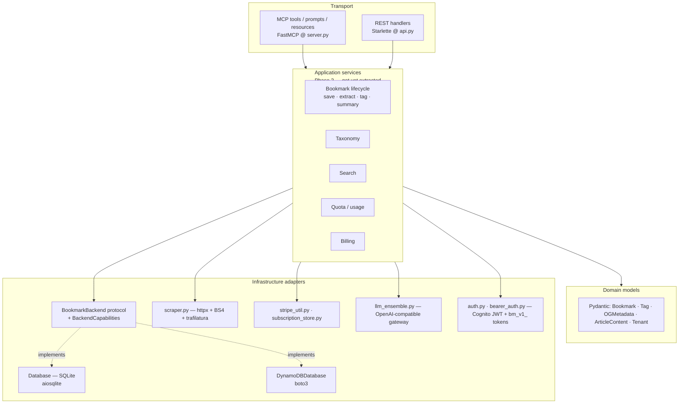

# Architecture

> Status: Phase 1 of [WDN-393 / OSS-3](https://linear.app/kayaman/issue/WDN-393).
> Phase 1 introduces the `BookmarkBackend` protocol and capability flags;
> Phase 2 (handler/service extraction) is tracked on the same ticket.

## Layers

The diagram shows the *target* state. Phase 1 of WDN-393 establishes the
`BookmarkBackend` contract between the application layer and the storage
adapters. Phase 2 will extract the application services that today live
inline in the transport handlers (`server.py`, `api.py`).

## What lives where

| Layer | Today (this repo) | Responsibility |
|---|---|---|
| **Transport** | `server.py` (MCP), `api.py` (REST), `cli.py` | Bind to a protocol/HTTP surface, parse request, format response |
| **Application services** | *Mostly inlined in transport handlers — Phase 2 target* | Orchestrate domain rules + infra calls; one service per use case |
| **Domain** | `models.py`, `request_context.py` | Pydantic models, per-request identity, business invariants |
| **Infrastructure** | `backend.py` (protocol), `db.py`, `dynamodb.py`, `scraper.py`, `stripe_util.py`, `subscription_store.py`, `llm_ensemble.py`, `usage_meter.py`, `auth.py`, `bearer_auth.py` | Talk to outside systems |

## `BookmarkBackend` protocol

Source: [`src/mcp_bookmarks/backend.py`](../src/mcp_bookmarks/backend.py).

The protocol captures the *shared* surface of `Database` (SQLite) and
`DynamoDBDatabase` (DynamoDB). It uses `typing.Protocol` with
`@runtime_checkable` so both existing classes conform by duck typing —
no inheritance change is required.

Key design decisions:

1. **Shared methods only.** Methods that exist on only one backend
   (e.g. `upsert_bookmark_embedding` for semantic search) live on the
   concrete class and are gated by a capability flag.
2. **Minimum signatures.** A concrete backend may accept *additional*
   keyword arguments — DynamoDB's `upsert_bookmark` takes `bookmark_type`,
   `flow_id`, `source` — but callers using the protocol type should pass
   only the fields the protocol declares.
3. **Capabilities are explicit.** `BackendCapabilities` is a frozen
   dataclass; backend choice no longer hides behind "this method may or
   may not be available." Callers query `backend.capabilities.X` and
   short-circuit with a structured "not supported on this backend"
   response when needed (the OSS-4 follow-up will formalize the
   short-circuit pattern).

### Capability matrix

| Capability | SQLite (`Database`) | DynamoDB (`DynamoDBDatabase`) | Why the asymmetry |
|---|:---:|:---:|---|
| `semantic_search` | ✅ | ❌ | Cloud vector pipeline is design-stage; see [`dynamodb-rag-design.md`](dynamodb-rag-design.md) |
| `paged_search` | ❌ | ✅ | DynamoDB's `search_bookmarks_paged` returns a `next_cursor` |
| `integer_bookmark_ids` | ✅ | ❌ | DynamoDB uses UUID strings as partition keys |
| `usage_metering` | ✅ | ❌ | DynamoDB delegates to optional `DYNAMODB_USAGE_TABLE` |
| `subscription_storage` | ✅ | ❌ | DynamoDB delegates to optional `DYNAMODB_SUBSCRIPTIONS_TABLE` |

## Application services (Phase 2 of WDN-393)

Handler logic that used to live inline in `server.py` (MCP tools) and
`api.py` (REST handlers) is now extracted into
[`src/mcp_bookmarks/services/`](../src/mcp_bookmarks/services/). Each
module owns a single responsibility; handlers are thin
parse-and-serialize layers.

| Module | Responsibility | Capability gates inside? |
|---|---|---|
| [`services/quota.py`](../src/mcp_bookmarks/services/quota.py) | `check`, `record`, `rest_block_response`, `mcp_block_string` | no (always runs) |
| [`services/bookmark.py`](../src/mcp_bookmarks/services/bookmark.py) | `save_with_metadata`, `extract_and_persist_content`, `set_summary`, `set_body`, `get_or_none`, `delete` | no |
| [`services/taxonomy.py`](../src/mcp_bookmarks/services/taxonomy.py) | tag CRUD + merge + `tag_bookmark` / `untag_bookmark` | no |
| [`services/search.py`](../src/mcp_bookmarks/services/search.py) | `search_bookmarks` (returns `(items, next_cursor)`) | **yes** — `paged_search` |
| [`services/embedding.py`](../src/mcp_bookmarks/services/embedding.py) | `index_bookmark`, `semantic_search` | **yes** — `semantic_search` |
| [`services/usage.py`](../src/mcp_bookmarks/services/usage.py) | `count_events_this_month` | **yes** — `usage_metering` |
| [`services/billing.py`](../src/mcp_bookmarks/services/billing.py) | `process_signed_payload` (Stripe webhook event dispatch) | no |

Key invariants:

- **Capability gates live in services, not handlers.** The four
  `cast(Any, db)` sites that used to live in transport code (per
  WDN-394) are gone; the casts now sit next to the
  `require_capability` call in the service module, where the
  protocol-vs-concrete gap is documented.
- **Quota state is one call.** `quota_service.check` returns
  `(ok, used, limit)`; the REST and MCP surfaces serialize the block
  differently (envelope vs JSON string) but share one call site for
  the limit check + structured-log event.
- **The scraper boundary lives in `bookmark.save_with_metadata`.**
  Both `POST /api/save` and the MCP `save_bookmark` tool route
  through it; the OG-fallback log only fires from one place.

Acceptance (per WDN-393) closes with this PR:

- [x] Core workflows (save, extract, tag, summary, search, usage) are
      application services.
- [x] Storage backends conform to `BookmarkBackend` with capability
      flags (Phase 1).
- [x] Transport code no longer owns persistence or quota logic directly.
- [x] Existing tests still pass (139 unit + integration).

## Related ADRs and tickets

**ADRs** (see [`docs/adr/`](adr/) for the full set):

- [ADR-0001](adr/0001-sqlite-dynamodb-dual-mode-storage.md) — SQLite + DynamoDB dual-mode storage
- [ADR-0002](adr/0002-mcp-rest-coexistence-on-single-starlette-app.md) — MCP + REST on a single Starlette app
- [ADR-0003](adr/0003-quota-and-usage-metering.md) — Quota state in the active backend
- [ADR-0004](adr/0004-backend-capability-divergence.md) — Backend capability flags
- [ADR-0005](adr/0005-vector-search-roadmap.md) — Vector search roadmap (cloud deferred)

**Tickets:**

- [WDN-393](https://linear.app/kayaman/issue/WDN-393) — this ticket
- [WDN-394 / OSS-4](https://linear.app/kayaman/issue/WDN-394) — capability
  enforcement (caller-side short-circuit), depends on this protocol
- [WDN-395 / OSS-5](https://linear.app/kayaman/issue/WDN-395) — deterministic
  test layout that this refactor depends on
- [`docs/dynamodb-rag-design.md`](dynamodb-rag-design.md) — design behind the
  `semantic_search` capability gap on DynamoDB
