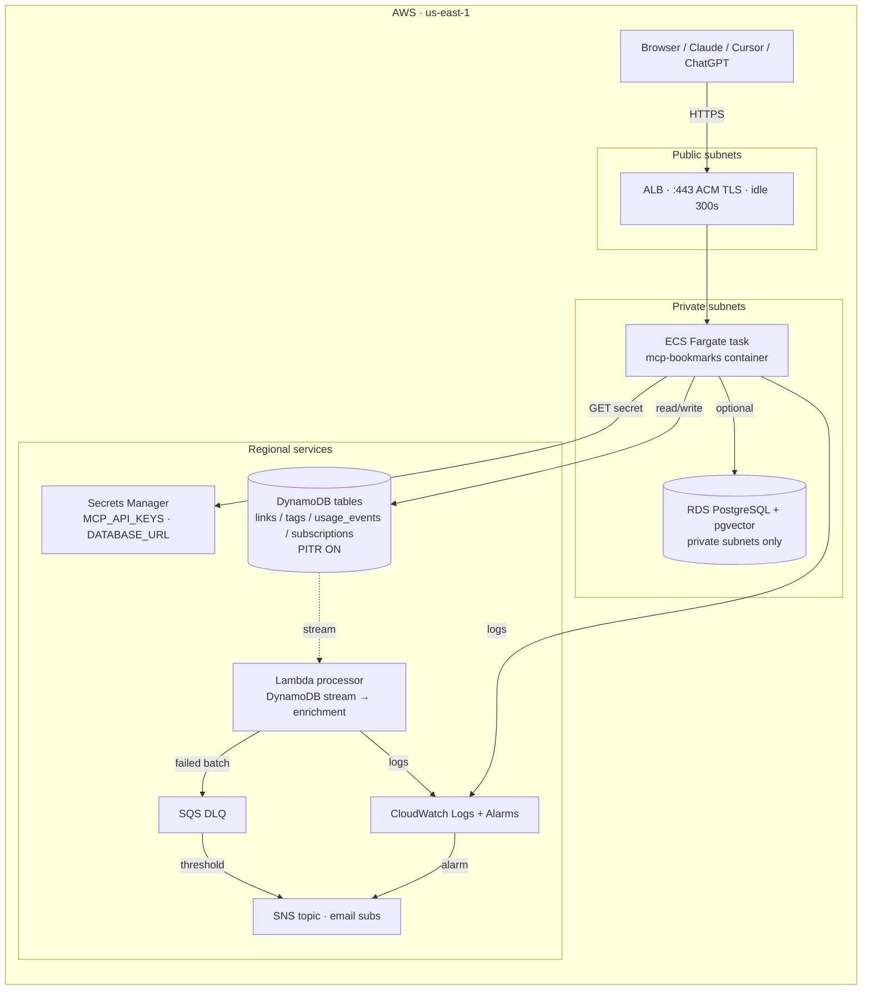

# Cloud infrastructure design

Hands-off reference for the Terraform stack in [`terraform/`](../terraform/).
Tracks WDN-398 / OSS-8. Pairs with [`docs/architecture.md`](architecture.md)
which documents the application-layer boundaries.

## Runtime architecture



## Trust boundaries

| Boundary | Crossed by | Controls |
|---|---|---|
| **Internet → ALB** | All client traffic | ACM TLS, ALB security group `:443` only |
| **ALB → ECS task** | Forwarded HTTP | SG-to-SG rule on container port; no public IP on the task |
| **ECS task → DynamoDB** | API calls | Task role scoped to the four specific table ARNs + their GSI ARNs |
| **ECS task → Secrets Manager** | Startup secret pull | Task **execution** role scoped to one ARN (`mcp-api-keys`) |
| **ECS task → RDS** | Direct DB connection | RDS in private subnets only, SG allows the task SG on port 5432 |
| **Lambda → DynamoDB stream** | Stream consumer | Lambda role scoped to the `links` stream ARN + tables + DLQ + own log group |
| **Lambda → CloudWatch Logs** | Log writes | Scoped to the explicit log group ARN (no `logs:*:*:*` wildcard) |
| **Operator (you) → AWS** | `terraform apply` | Static IAM user with PowerUser or a custom least-privilege role |
| **GitHub Actions → AWS** | `mcp-toggle` workflow | OIDC role on `${prefix}-prod-cluster`, scoped per `scripts/provision-github-oidc-role.sh` |

## Failure domains

| Component | Failure mode | Blast radius | Mitigation |
|---|---|---|---|
| Single ECS task | Crash / OOM | All requests until ALB retries | Set `ecs_desired_count = 2`+ to run multi-task; ALB health checks re-route |
| Single-AZ ECS deployment | AZ outage | Total outage for the AZ | Default config spreads tasks across the two private subnets (different AZs) when `ecs_desired_count >= 2` |
| DynamoDB throttle | Burst above on-demand limits | Increased latency, errors | Alarms in [`alarms.tf`](../terraform/alarms.tf) fire on `ReadThrottleEvents` / `WriteThrottleEvents` |
| Lambda failure | Enrichment pipeline degraded | Bookmarks save but stay un-enriched | `bisect_batch_on_function_error = true` + DLQ + alarm on DLQ depth |
| RDS instance failure | pgvector path degraded | Semantic-search-on-cloud (when wired) | `backup_retention_period = 7d` in prod; manual snapshot + restore |
| Region outage | All paths down | Total outage | Out of scope for this stack (single-region by design); design notes in [`docs/multicloud.md`](multicloud.md) |

## Recovery objectives (RPO / RTO)

| Data store | RPO target | RTO target | How |
|---|---|---|---|
| **DynamoDB** (links/tags/usage/subscriptions) | ≤ 5 minutes | ≤ 30 minutes | Point-in-time recovery (PITR) is **enabled** on all four tables. Restore via AWS console or `aws dynamodb restore-table-to-point-in-time`. |
| **RDS PostgreSQL** | ≤ 24 hours | ≤ 60 minutes | Automated daily snapshots, retained 7 days in prod, 1 in dev. Manual snapshots before destructive operations. |
| **Secrets Manager** | 0 (no data loss) | seconds | Version history on each secret; `recovery_window_in_days = 0` is deliberate so rotation re-binds immediately. |
| **ECR images** | 0 | minutes | Image tags are immutable in practice; the deploy pipeline rolls forward, not back. |

## Monitoring + alerting

All alarms in [`terraform/alarms.tf`](../terraform/alarms.tf) publish to a single SNS topic (`${prefix}-alerts`) with `var.budget_alert_email` subscribed. Per-alarm thresholds:

| Alarm | Threshold | Window |
|---|---|---|
| `alb-target-5xx` | > 5 in 1 min | 2 of 2 |
| `alb-target-p99-latency` | > 2.0s | 3 of 3 (1 min each) |
| `ddb-<table>-read-throttle` | > 0 | 1 of 1 (5 min) |
| `ddb-<table>-write-throttle` | > 0 | 1 of 1 (5 min) |
| `lambda-processor-errors` | > 1 | 1 of 1 (5 min) |
| `lambda-processor-duration-p95` | > 240,000 ms (80% of 300s timeout) | 2 of 2 (5 min each) |
| `lambda-dlq-not-empty` | > 0 | 1 of 1 (5 min) |

Budget alarms (cost) live in [`terraform/budgets.tf`](../terraform/budgets.tf) — 80% warn / 100% breach on the monthly USD limit. SNS for *cost* is separate from the operational topic above; cost notifications go directly to the email per AWS Budgets' built-in `subscriber_email_addresses`.

## Scaling path

1. **Vertical**: bump `db_instance_class` (RDS) or container `cpu`/`memory` in `ecs.tf`. No state change.
2. **Horizontal — task count**: raise `ecs_desired_count`. The ALB target group already supports N tasks; SQLite mode does not (state on local disk), but DynamoDB mode does because every backend call is stateless.
3. **Horizontal — region**: not in scope today. Adding a second region requires:
   - Per-region DynamoDB Global Table replication
   - Global Accelerator or Route53 latency-based routing in front of two ALBs
   - Secrets Manager replica configuration
   - Per-region ECR repos
   See [`docs/multicloud.md`](multicloud.md) for the broader thinking.

## Environment separation

Today: one stack per AWS account, parameterized by `var.environment`. The
default `terraform.tfvars` ships with `environment = "prod"`; for a
staging cut:

```bash
# Option A — separate workspace (same state backend, different state file)
terraform workspace new staging
terraform apply -var-file=staging.tfvars

# Option B — separate state files in different directories
TF_WORKSPACE=staging terraform apply -var-file=staging.tfvars
```

Both options name resources `${var.project_name}-${var.environment}-*`,
so the prefix `mcp-bookmarks-staging-*` cannot collide with `mcp-bookmarks-prod-*` in the same account.

Per-environment defaults today:

| Variable | Dev / staging | Prod |
|---|---|---|
| `db_instance_class` | `db.t4g.micro` | `db.t4g.medium`+ |
| `ecs_desired_count` | `0` (off until image pushed) | `1`+ |
| `enable_alb` | `false` | `true` |
| `enable_lambda_processor` | `false` | `true` |
| `backup_retention_period` (RDS) | `1` | `7` |

## Secret handling audit

| Secret | Storage | Read by | tfvars plaintext? |
|---|---|---|---|
| `MCP_API_KEYS` | Secrets Manager (`${prefix}-mcp-api-keys`) | ECS task at startup (via task execution role) | **No.** Use `TF_VAR_mcp_api_keys` env var |
| `DATABASE_URL` (RDS) | Secrets Manager (`${prefix}/database-url`) | App code via Secrets Manager API | **No.** Built from `random_password` at apply time |
| `STRIPE_WEBHOOK_SECRET` | Env var on the ECS task | Webhook handler | **No.** Use `TF_VAR_stripe_webhook_secret` |
| `ANTHROPIC_API_KEY` | Lambda env var | Enrichment Lambda | **No.** Use `TF_VAR_anthropic_api_key` |
| `AI_GATEWAY_API_KEY` | ECS task env var | `ensemble_with_judge` tool | **No.** Use `TF_VAR_gateway_api_key` |

`terraform.tfvars.example` shipped in the repo carries placeholders only
(`REPLACE_ME`, empty strings) and is the only file with anything sensitive-shaped — the real `terraform.tfvars` is gitignored.

## IAM scoping

A single sweep across `terraform/*.tf` shows no `Resource = "*"`. Every
policy attaches by full ARN. The only place pattern-matching IS used is
DynamoDB GSI ARNs (`"${table.arn}/index/*"`), which is the canonical
shape AWS docs themselves recommend for granting access to all of a
table's indexes.

## Module layout (future PR)

The current stack is intentionally flat: 16 root-level `.tf` files. As
the stack grows past ~30 resources or two environments, modularization
pays off. Recommended split (NOT in this PR):

```
terraform/
├── modules/
│   ├── network/        # vpc.tf, security_groups.tf
│   ├── data/           # dynamodb*.tf, rds.tf, secrets.tf
│   ├── compute/        # ecs.tf, lambda.tf, ecr.tf, sqs.tf, alb.tf, acm.tf
│   └── observability/  # alarms.tf, budgets.tf, outputs.tf
└── envs/
    ├── prod/main.tf    # module compositions for prod
    └── staging/main.tf
```

Tracked separately on WDN-398 if/when the team chooses to invest.

## Related documents

- [`docs/architecture.md`](architecture.md) — application-layer boundaries
- [`docs/production-readiness.md`](production-readiness.md) — what's wired vs unwired in code
- [`docs/production-smoke.md`](production-smoke.md) — post-deploy validation commands
- [`docs/infra-disposable-runbook.md`](infra-disposable-runbook.md) — destroy + re-apply checklist
- [`docs/multicloud.md`](multicloud.md) — forward-looking multi-region notes
