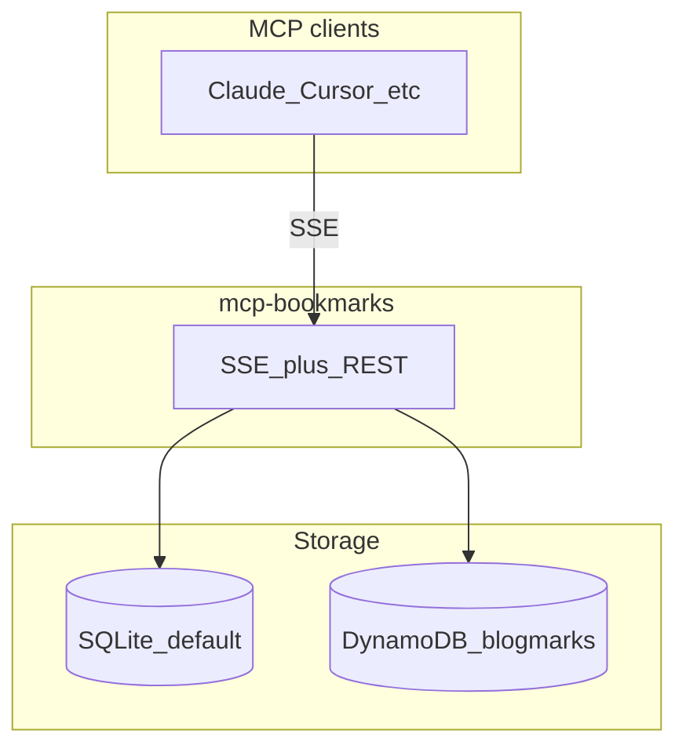

# mcp-bookmarks

**Bookmark-native knowledge for agents**

Save links, extract articles, tag, summarize — then **search and reason** from what you already curated.

<div class="pt-12">
  <span class="text-sm opacity-70">Model Context Protocol · SQLite or DynamoDB</span>
</div>

---

# The gap

- Bookmarks and “read later” piles are **everywhere**; context is **fragmented**.
- LLMs excel at **live** search, but your **trusted** sources are the ones **you saved**.
- Agents need **grounded** access to that corpus — not another generic file bucket.

**We connect the bookmark lifecycle to MCP clients** (Claude, Cursor, …).

---

# What we built

An **MCP server** (FastMCP + SSE + REST) that runs a clear pipeline:

1. **`save_bookmark(url)`** — Open Graph + metadata  
2. **`extract_content`** — full article text (trafilatura / fallbacks)  
3. **Taxonomy** — tags with descriptions; the model **reuses** tags deliberately  
4. **`set_summary`** — concise AI summary stored on the item  

Optional: **`set_bookmark_body`** when another tool (Bright Data, Tavily, …) already fetched the page.

---

# Who it’s for

- **Developers** using **Claude Desktop**, **Claude Code**, **Cursor**, or any MCP client over **SSE**
- Teams that want **one** curated link store **inside** agent workflows
- Users of **[blogmarks.dev](https://blogmarks.dev)** who want the **same data** from the assistant (`DYNAMODB_MODE=true`)

---

# Architecture



Same tools; **SQLite** for local-only, **DynamoDB** for live Blogmarks tables.

---

# RAG today

| Piece | Role |
|-------|------|
| **`index_bookmark_embedding`** | OpenAI embeddings on title + description + content |
| **`semantic_search_bookmarks`** | Cosine similarity over stored vectors |
| **`knowledge_query`** (prompt) | Keyword search + `read_bookmark` + synthesis **in the client LLM** |

**Note:** Full vector indexing is **SQLite-only** today. DynamoDB mode uses **keyword** `search_bookmarks` for retrieval until a cloud vector pipeline ships.

---

# Cloud mode — Blogmarks

- **`DYNAMODB_MODE=true`** — same item shape as the PWA: `aiContent`, `aiSummary`, `aiTags`, …
- **Semantic search in the cloud** is specified in the repo design doc — **chunking + vector store** (e.g. pgvector / OpenSearch) — **not yet implemented** in code.

See `docs/dynamodb-rag-design.md` in the repository.

---

# Market reality

- **Generic RAG-as-a-service** (embed anything, chat your PDFs) is **crowded** — hyperscalers and many startups.
- **Our wedge** is **not** “yet another embeddings API.”
- It’s the **end-to-end link workflow**: capture → extract → **taxonomy** → retrieve — **first-class for MCP / agents**.

Read-later apps optimize reading UX; we optimize **structured, agent-addressable memory**.

---

# What we are not (for now)

- Not a commodity **“upload any corpus”** product without the bookmark story
- Not competing head-on on **generic document RAG** alone

Scope is intentional: **vertical-first**, optional horizontal APIs later (e.g. REST RAG query) on the same auth/usage layer.

---

# Optional SaaS hooks (in the repo)

When you need gates and billing wiring:

- **`MCP_API_KEYS`** — REST auth; optional `key:org` tenant mapping  
- **`GET /api/usage`** — monthly event counts  
- **`MCP_MONTHLY_USAGE_LIMIT`** — quotas on MCP tools + some REST paths  
- **`POST /webhooks/stripe`** — subscription snapshots (SQLite and/or DynamoDB table)

Production checklist: `docs/production-readiness.md`.

---

# Roadmap (high level)

1. **DynamoDB / blogmarks** — chunking, embedding model versioning, **vector index** (design in `docs/dynamodb-rag-design.md`)
2. **Unified semantic search** across SQLite and cloud once indexing exists
3. Optional **`POST /api/rag/search`** — citations (title, URL, snippet, score) with existing API keys

Product positioning: `docs/product-positioning.md`.

---

# Try it

```bash
uv sync
uv run mcp-bookmarks
```

Connect MCP client to **`http://localhost:8000/sse`** (or your host/port).

- **Site:** [blogmarks.dev](https://blogmarks.dev)  
- **Source:** [github.com/kayaman/mcp-bookmarks](https://github.com/kayaman/mcp-bookmarks)  

```text
claude mcp add --transport sse bookmarks http://localhost:8000/sse
```

**Thank you.** Questions welcome.
