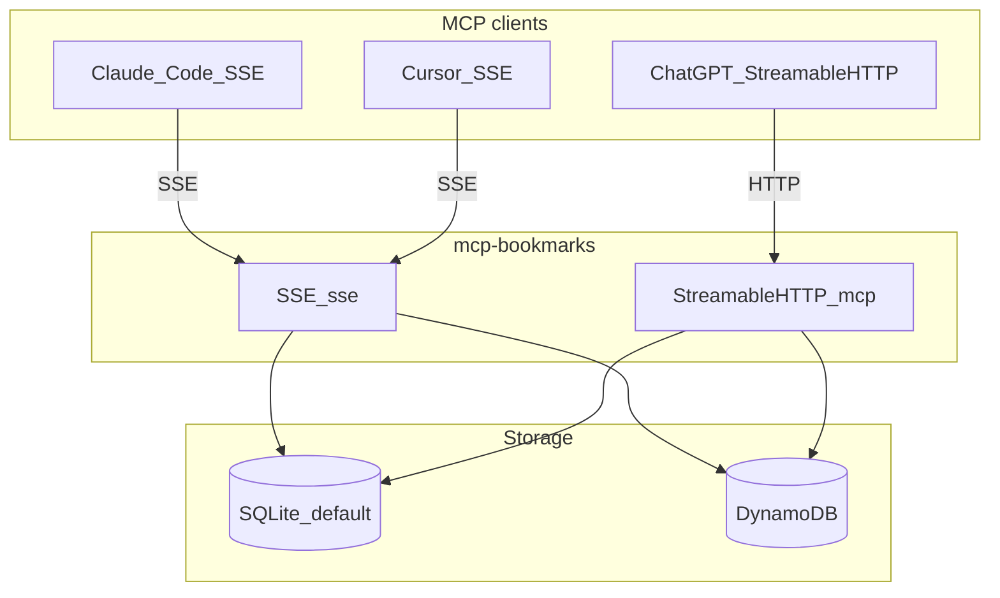
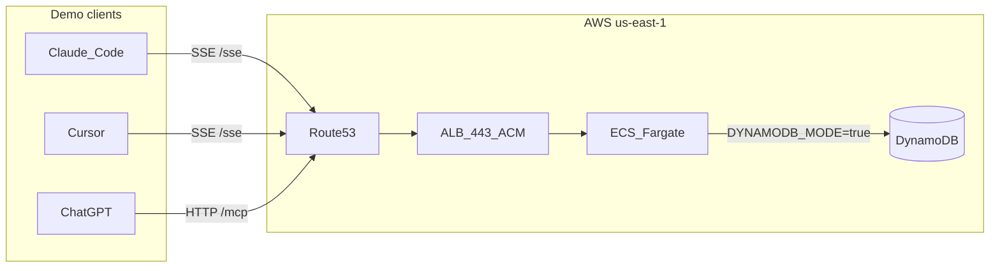

# mcp-bookmarks

**Bookmark-native knowledge for agents**

Save links, extract articles, tag, summarize — then **search and reason** from what you already curated.

<div class="pt-12">
  <span class="text-sm opacity-70">Model Context Protocol · SQLite or DynamoDB</span>
</div>

---

# The gap

- Bookmarks and “read later” piles are **everywhere**; context is **fragmented**.
- LLMs excel at **live** search, but your **trusted** sources are the ones **you saved**.
- Agents need **grounded** access to that corpus — not another generic file bucket.

**We connect the bookmark lifecycle to MCP clients** (Claude, Cursor, …).

---

# What we built

An **MCP server** (FastMCP + SSE + REST) that runs a clear pipeline:

1. **`save_bookmark(url)`** — Open Graph + metadata  
2. **`extract_content`** — full article text (trafilatura / fallbacks)  
3. **Taxonomy** — tags with descriptions; the model **reuses** tags deliberately  
4. **`set_summary`** — concise AI summary stored on the item  

Optional: **`set_bookmark_body`** when another tool (Bright Data, Tavily, …) already fetched the page.

---

# Who it’s for

- **Developers** using **Claude Code**, **Cursor**, **ChatGPT**, or any MCP client
- Teams that want **one** curated link store **inside** agent workflows
- Anyone running a first-party app (browser/mobile/PWA) who wants the **same data** from the assistant via `DYNAMODB_MODE=true`

---

# Architecture



Same 19 tools across **both transports**; **SQLite** for local-only, **DynamoDB** for cloud deployments.

---

# Live on production

**`https://<your-mcp-host>`**



ECS Fargate · ACM TLS · `MCP_API_KEYS` in Secrets Manager

---

# Demo flow (5 minutes)

Same steps across all three clients — compare UX, not behavior:

| Step | Tool / Resource | Proof |
|------|-----------------|-------|
| 1 | `save_bookmark(url)` | UUID returned → DynamoDB write |
| 2 | Resource `bookmarks://taxonomy` | Tag list with descriptions |
| 3 | Prompt `save_and_tag(url)` | Full pipeline: extract → tag → summarize |
| 4 | `search_bookmarks(query="agents")` | New item appears in results |
| 5 | `read_bookmark(<id>)` or AWS console | Item shape matches DDB write |

---

# Client 1 — Claude Code

```bash
export MCP_API_KEY="<demo-token>"

claude mcp add --transport sse bookmarks \
  https://<your-mcp-host>/sse \
  --header "Authorization: Bearer $MCP_API_KEY"
```

Transport: **SSE** (`/sse`)  
19 tools · 4 prompts · 2 resources exposed immediately

```bash
# Smoke check
curl -s https://<your-mcp-host>/api/stats \
  -H "Authorization: Bearer $MCP_API_KEY"
# → {"total_bookmarks": N, "total_tags": M}
```

---

# Client 2 — Cursor IDE

`.cursor/mcp.json` (project or global):

```json
{
  "mcpServers": {
    "bookmarks": {
      "type": "sse",
      "url": "https://<your-mcp-host>/sse",
      "headers": {
        "Authorization": "Bearer ${env:MCP_API_KEY}"
      }
    }
  }
}
```

`Cmd+Shift+P` → **MCP: Reload Servers** → confirm 19 tools  
`${env:MCP_API_KEY}` keeps the token out of committed files

---

# Client 3 — ChatGPT Custom Connector

**Settings → Connectors → Add custom connector**

| Field | Value |
|-------|-------|
| URL | `https://<your-mcp-host>/mcp` |
| Auth | Bearer token → `<demo-token>` |

Transport: **Streamable HTTP** (`/mcp`)  
ChatGPT cannot use `/sse` — you must use `/mcp`

> Requires ChatGPT Plus / Pro / Team plan

---

# RAG today

| Piece | Role |
|-------|------|
| **`index_bookmark_embedding`** | OpenAI embeddings on title + description + content |
| **`semantic_search_bookmarks`** | Cosine similarity over stored vectors |
| **`knowledge_query`** (prompt) | Keyword search + `read_bookmark` + synthesis **in the client LLM** |

**Note:** Full vector indexing is **SQLite-only** today. DynamoDB mode uses **keyword** `search_bookmarks` for retrieval until a cloud vector pipeline ships.

---

# Cloud mode — DynamoDB

- **`DYNAMODB_MODE=true`** — canonical camelCase item shape: `aiContent`, `aiSummary`, `aiTags`, …
- **Semantic search in the cloud** is specified in the repo design doc — **chunking + vector store** (e.g. pgvector / OpenSearch) — **not yet implemented** in code.

See `docs/dynamodb-rag-design.md` in the repository.

---

# Market reality

- **Generic RAG-as-a-service** (embed anything, chat your PDFs) is **crowded** — hyperscalers and many startups.
- **Our wedge** is **not** “yet another embeddings API.”
- It’s the **end-to-end link workflow**: capture → extract → **taxonomy** → retrieve — **first-class for MCP / agents**.

Read-later apps optimize reading UX; we optimize **structured, agent-addressable memory**.

---

# What we are not (for now)

- Not a commodity **“upload any corpus”** product without the bookmark story
- Not competing head-on on **generic document RAG** alone

Scope is intentional: **vertical-first**, optional horizontal APIs later (e.g. REST RAG query) on the same auth/usage layer.

---

# Optional SaaS hooks (in the repo)

When you need gates and billing wiring:

- **`MCP_API_KEYS`** — REST auth; optional `key:org` tenant mapping  
- **`GET /api/usage`** — monthly event counts  
- **`MCP_MONTHLY_USAGE_LIMIT`** — quotas on MCP tools + some REST paths  
- **`POST /webhooks/stripe`** — subscription snapshots (SQLite and/or DynamoDB table)

Production checklist: `docs/production-readiness.md`.

---

# Roadmap (high level)

1. **DynamoDB mode** — chunking, embedding model versioning, **vector index** (design in `docs/dynamodb-rag-design.md`)
2. **Unified semantic search** across SQLite and cloud once indexing exists
3. Optional **`POST /api/rag/search`** — citations (title, URL, snippet, score) with existing API keys

Product positioning: `docs/product-positioning.md`.

---

# Try it now

**Production endpoint (live):**

```bash
# SSE — Claude Code, Cursor
curl -N -H "Accept: text/event-stream" \
     -H "Authorization: Bearer $MCP_API_KEY" \
     https://<your-mcp-host>/sse

# Claude Code
claude mcp add --transport sse bookmarks \
  https://<your-mcp-host>/sse \
  --header "Authorization: Bearer $MCP_API_KEY"
```

**ChatGPT:** Settings → Connectors → `https://<your-mcp-host>/mcp`

**Local dev:**

```bash
uv sync && uv run mcp-bookmarks
# → http://localhost:8000/sse  (SSE)
# → http://localhost:8000/mcp  (Streamable HTTP)
```

- **Repo:** `kayaman/mcp-bookmarks`
- **Docs:** [docs/demo/](https://github.com/kayaman/mcp-bookmarks/tree/main/docs/demo)  

**Thank you.** Questions welcome.
